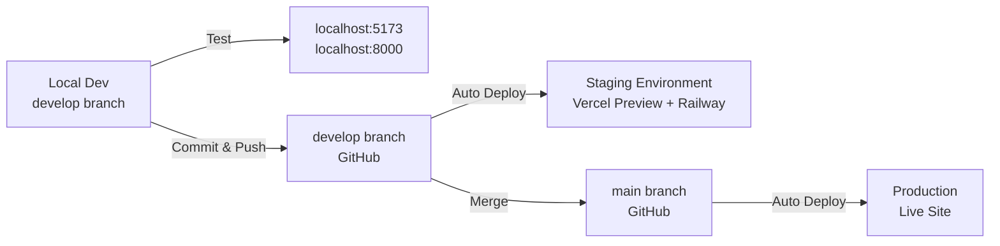

# Development Workflow Guide

This guide explains how to develop and test the PeriodCycle.AI application locally, and how to manage the development and production branches.

## Table of Contents

- [Prerequisites](#prerequisites)
- [Local Development Setup](#local-development-setup)
- [Running the Application Locally](#running-the-application-locally)
- [Testing Changes Locally](#testing-changes-locally)
- [Branch Workflow](#branch-workflow)
- [Deployment Environments](#deployment-environments)
- [Environment Variables](#environment-variables)
- [Troubleshooting](#troubleshooting)

> **Note**: For detailed deployment configuration instructions, see [DEPLOYMENT_CONFIG.md](./DEPLOYMENT_CONFIG.md)

---

## Prerequisites

Before you begin, make sure you have the following installed:

- **Node.js** (v18 or higher) - [Download](https://nodejs.org/)
- **Python** (v3.8 or higher) - [Download](https://www.python.org/downloads/)
- **Git** - [Download](https://git-scm.com/downloads)
- **Supabase Account** - [Sign up](https://supabase.com/) (for database access)
- **API Keys**:
  - Gemini API Key (for AI chat)
  - RapidAPI Key (for cycle predictions)

---

## Local Development Setup

### 1. Clone and Setup Repository

```bash
# Clone the repository (if not already done)
git clone https://github.com/itsvaidahipatel/theperiodapp.git
cd theperiodapp

# Checkout the develop branch
git checkout develop
```

### 2. Backend Setup

```bash
cd backend

# Create virtual environment
python3 -m venv venv

# Activate virtual environment
# On macOS/Linux:
source venv/bin/activate
# On Windows:
# venv\Scripts\activate

# Install dependencies
pip install -r requirements.txt

# Copy environment template and fill in your values
cp .env.example .env
# Edit .env with your actual values (see Environment Variables section)
```

### 3. Frontend Setup

```bash
cd frontend

# Install dependencies
npm install

# Copy environment template (optional - defaults to localhost:8000)
cp .env.local.example .env.local
# Edit .env.local if you want to customize (usually not needed for local dev)
```

---

## Running the Application Locally

### Option 1: Using the Start Script (Recommended)

The easiest way to start both frontend and backend:

```bash
# From the project root directory
./start.sh

# Or use the shorter alias
./dev.sh
```

This script will:
- Check if virtual environment and dependencies are installed
- Start the backend server on `http://localhost:8000`
- Start the frontend server on `http://localhost:5173`
- Show you helpful URLs and tips

Press `Ctrl+C` to stop both servers.

### Option 2: Manual Startup

If you prefer to run them separately:

**Terminal 1 - Backend:**
```bash
cd backend
source venv/bin/activate  # On Windows: venv\Scripts\activate
uvicorn main:app --reload --host 0.0.0.0 --port 8000
```

**Terminal 2 - Frontend:**
```bash
cd frontend
npm run dev
```

### Accessing the Application

Once running, you can access:

- **Frontend**: http://localhost:5173
- **Backend API**: http://localhost:8000
- **API Documentation**: http://localhost:8000/docs

---

## Testing Changes Locally

### Hot Reload

Both frontend and backend support hot reload:

- **Frontend**: Vite automatically reloads when you save changes to React components
- **Backend**: Uvicorn with `--reload` flag restarts when you save Python files

### Testing Workflow

1. **Make changes** to your code in Cursor/your editor
2. **Save the file** - changes will automatically reload
3. **Test in browser** at `http://localhost:5173`
4. **Check console** for any errors
5. **No need to push to GitHub** - test everything locally first!

### Testing Different Features

- **Frontend changes**: Edit files in `frontend/src/` - see changes instantly
- **Backend changes**: Edit files in `backend/` - backend restarts automatically
- **Database changes**: Changes are reflected immediately (connected to Supabase)
- **API changes**: Test API endpoints at `http://localhost:8000/docs`

---

## Branch Workflow

### Branch Strategy

- **`main`** branch = Production (live website)
- **`develop`** branch = Development/Testing (staging environment)

### Development Workflow



### Step-by-Step Workflow

1. **Start with develop branch**
   ```bash
   git checkout develop
   git pull origin develop
   ```

2. **Create a feature branch (optional but recommended)**
   ```bash
   git checkout -b feature/your-feature-name
   ```

3. **Make changes and test locally**
   - Run `./start.sh` or `./dev.sh`
   - Test your changes at `localhost:5173`
   - Make sure everything works

4. **Commit your changes**
   ```bash
   git add .
   git commit -m "Description of your changes"
   git push origin develop  # or your feature branch
   ```

5. **Push to develop branch**
   - Changes automatically deploy to staging environment
   - Test in staging environment

6. **When ready for production**
   ```bash
   # Merge develop into main
   git checkout main
   git pull origin main
   git merge develop
   git push origin main
   ```
   - Changes automatically deploy to production

### Quick Reference Commands

```bash
# Switch to develop branch
git checkout develop

# Switch to main branch
git checkout main

# Create a new feature branch from develop
git checkout develop
git checkout -b feature/my-feature

# Merge develop into main (for production release)
git checkout main
git pull origin main
git merge develop
git push origin main
```

---

## Deployment Environments

### Local Environment
- **Frontend**: `http://localhost:5173`
- **Backend**: `http://localhost:8000`
- **Use**: Development and testing
- **How**: Run `./start.sh` locally

### Staging Environment (develop branch)
- **Frontend**: Vercel Preview URL (generated automatically)
- **Backend**: Railway staging service (if configured)
- **Use**: Testing before production
- **How**: Push to `develop` branch → auto-deploys

### Production Environment (main branch)
- **Frontend**: Your production Vercel URL
- **Backend**: Your production Railway service
- **Use**: Live website for users
- **How**: Push to `main` branch → auto-deploys

---

## Environment Variables

### Backend Environment Variables

Create `backend/.env` file from `backend/.env.example`:

```env
# Required
SUPABASE_URL=your-supabase-url
SUPABASE_KEY=your-supabase-anon-key
SUPABASE_SERVICE_ROLE_KEY=your-service-role-key
GEMINI_API_KEY=your-gemini-api-key
RAPIDAPI_KEY=your-rapidapi-key

# Optional (has defaults)
JWT_SECRET_KEY=your-secret-key-change-in-production
JWT_ALGORITHM=HS256
CORS_ORIGINS=http://localhost:5173

# Email Service (optional - for notifications)
SMTP_SERVER=smtp.gmail.com
SMTP_PORT=587
SMTP_USERNAME=your-email@gmail.com
SMTP_PASSWORD=your-gmail-app-password
FROM_EMAIL=your-email@gmail.com
APP_NAME=PeriodCycle.AI
```

### Frontend Environment Variables

Create `frontend/.env.local` file from `frontend/.env.local.example`:

```env
# For local development (usually not needed - defaults to localhost:8000)
VITE_API_BASE_URL=http://localhost:8000
```

**Note**: In production, Vercel automatically sets `VITE_API_BASE_URL` to your Railway backend URL.

### Setting Environment Variables in Vercel

1. Go to your Vercel project dashboard
2. Navigate to **Settings** → **Environment Variables**
3. Add `VITE_API_BASE_URL` pointing to your Railway backend URL
4. Set it for **Production**, **Preview**, and **Development** environments

### Setting Environment Variables in Railway

1. Go to your Railway project dashboard
2. Select your service
3. Navigate to **Variables** tab
4. Add all required environment variables (same as `backend/.env`)

---

## Troubleshooting

### Backend won't start

**Issue**: `ModuleNotFoundError` or import errors
```bash
# Solution: Make sure virtual environment is activated and dependencies are installed
cd backend
source venv/bin/activate
pip install -r requirements.txt
```

**Issue**: Port 8000 already in use
```bash
# Solution: Find and kill the process using port 8000
# On macOS/Linux:
lsof -ti:8000 | xargs kill
# Or change the port in start.sh
```

### Frontend won't start

**Issue**: Port 5173 already in use
```bash
# Solution: Vite will automatically try the next available port
# Or manually specify a different port in vite.config.js
```

**Issue**: `Module not found` errors
```bash
# Solution: Reinstall dependencies
cd frontend
rm -rf node_modules package-lock.json
npm install
```

### Can't connect frontend to backend

**Issue**: Frontend shows connection errors
- Check that backend is running on `http://localhost:8000`
- Verify `VITE_API_BASE_URL` in `frontend/.env.local` is set to `http://localhost:8000`
- Check browser console for CORS errors (backend should allow `localhost:5173`)

### Environment variables not loading

**Issue**: Backend can't find environment variables
- Make sure `backend/.env` file exists (not just `.env.example`)
- Verify the file is in the `backend/` directory
- Check that `.env` is not in `.gitignore` (it should be, but make sure the file exists locally)

### Database connection errors

**Issue**: Can't connect to Supabase
- Verify `SUPABASE_URL` and `SUPABASE_KEY` are correct in `backend/.env`
- Check your Supabase project is active
- Verify your IP is whitelisted in Supabase (if required)

---

## Best Practices

1. **Always test locally first** - Don't push untested code
2. **Use feature branches** - Create branches for new features from `develop`
3. **Test in staging** - Push to `develop` and test in staging before production
4. **Keep commits small** - Make focused, logical commits
5. **Write clear commit messages** - Explain what and why, not just what
6. **Don't commit `.env` files** - Use `.env.example` templates
7. **Keep dependencies updated** - Regularly update npm and pip packages

---

## Quick Start Checklist

- [ ] Clone repository
- [ ] Checkout `develop` branch
- [ ] Create and configure `backend/.env` from `backend/.env.example`
- [ ] Install backend dependencies (`pip install -r requirements.txt`)
- [ ] Install frontend dependencies (`npm install`)
- [ ] Run `./start.sh` or `./dev.sh`
- [ ] Open `http://localhost:5173` in your browser
- [ ] Start coding!

---

## Need Help?

If you encounter issues not covered in this guide:

1. Check the troubleshooting section above
2. Review error messages in terminal and browser console
3. Check that all prerequisites are installed correctly
4. Verify environment variables are set correctly
5. Make sure you're on the correct branch (`develop` for development)

Happy coding! 🚀
